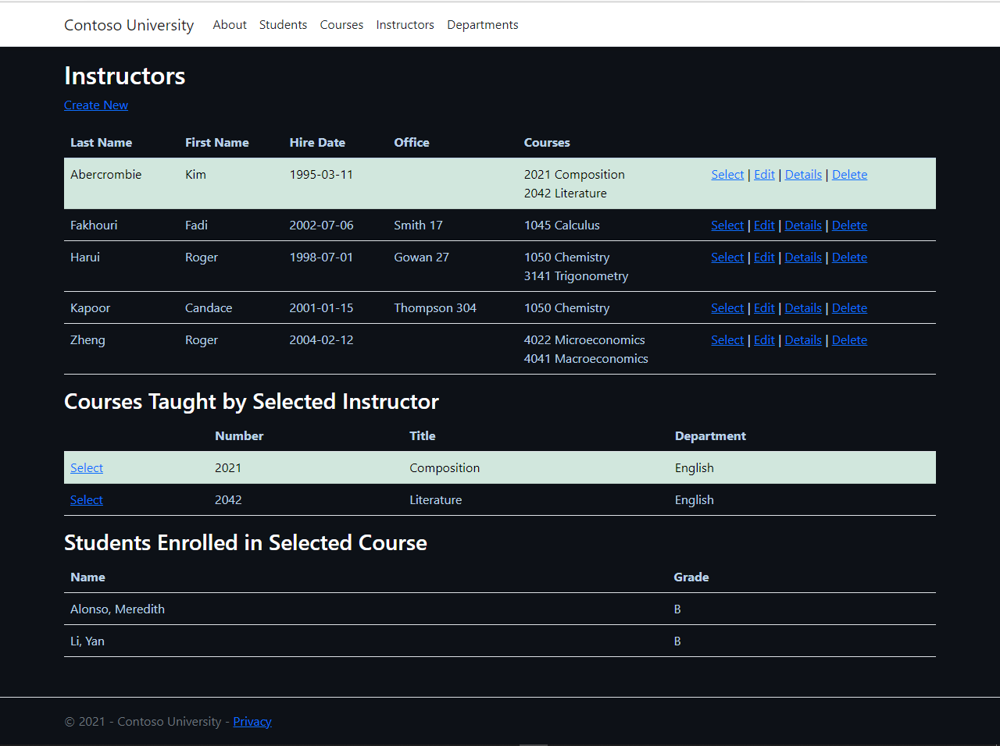

# Workshop (W45-2022) during the DAWAN .NET Developer training cycle 
For this free subject I decided to realize the Razor Pages with Entity Framework Core in ASP.NET Core tutorial - ContosoUniversity from the Microsoft platform (https://learn.microsoft.com/en-us/aspnet/core/data/ef-rp/intro?view=aspnetcore-6.0&tabs=visual-studio) as it allows me to pratice the use of the Entity Framework and familiarize myself with Razor Pages structure and construction.

End of Part 6 : Read Related Data

